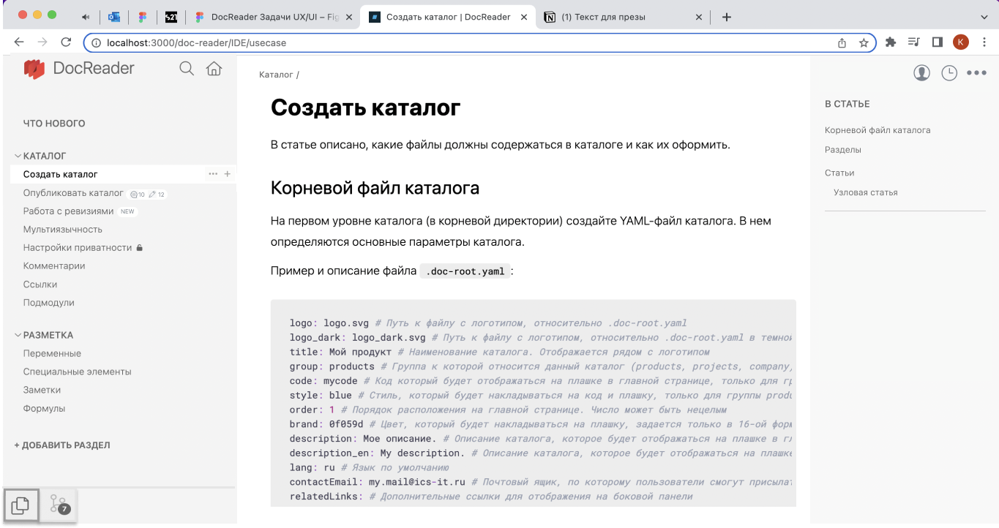

**IDE для базы знаний** -- общее пространство, в котором могут работать как разработчики, так и нетехнические специалисты.

*Черновой макет приложения со всеми возможностями*

Ключевые возможности:
- **Визуальный редактор**. Ориентируемся на Notion + горячие клавиши. 
- **Интерфейс для работы с Git**. Все действия можно выполнять в приложении DR и не переключаться в редактор кода или консоль.
- **Комментарии**. Можно проводить ревью в интерфейсе DR.
- **Уведомления**. Организованы привычным способом -- как в соцсетях. Оповещают о новых статьях, комментариях, а также о любых других изменениях.
- **История изменений**. 

Инженерные практики:
- **Self-hosted**. Система разворачивается на собственном сервере.
- **Кастомные расширения**. Можно самостоятельно разработать модуль и подключить его к DR.
- **Проверка на ошибки**. Встроенными возможностями DR или/и при подключении к CI/CD.
- **Статическая документация**. Возможность скомпилировать каталог в HTML.

