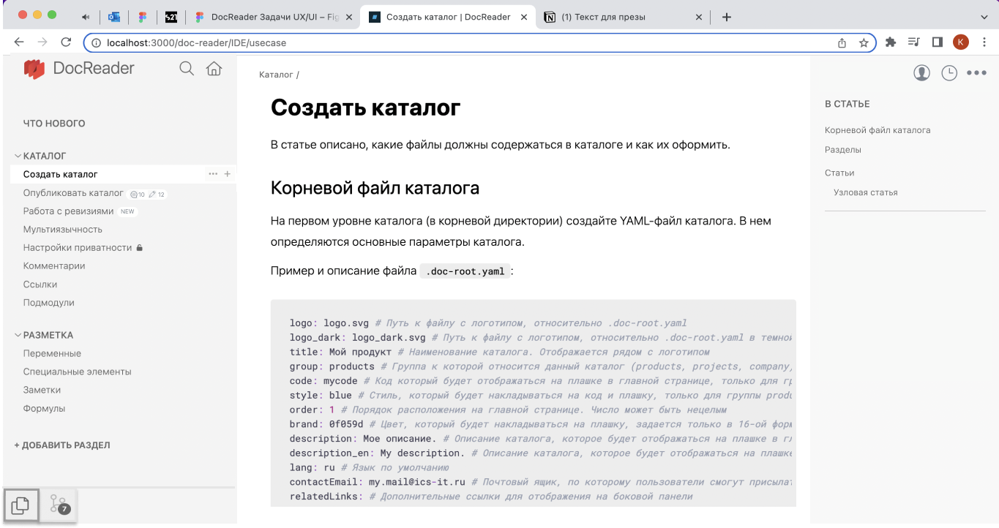

## Правая панель

*Черновой макет*

- В правой панели оставляем только *В статье* и список заголовков, все остальные возможности прячем под иконки.

- Иконка с троеточием содержит:

   - *Сохранить статью в DOCX*.

   - *Сохранить каталог в DOCX*.

   - *Редактировать в GitLab*.

   - *Редактировать в VSCode*.

   - *Проверка на ошибки*.

   - *Git pull* (временно, пока не сделаем интерфейс публикации).

- Иконка с пользователем содержит:

   - Язык.

   - Тема.

   - Выйти.
   
   - Уведомления (что содержит -- в статье *[Уведомления](.../IDE/new/notification)*.

- Иконка с часами содержит историю изменений.

