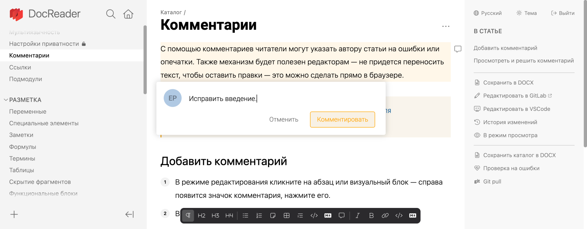
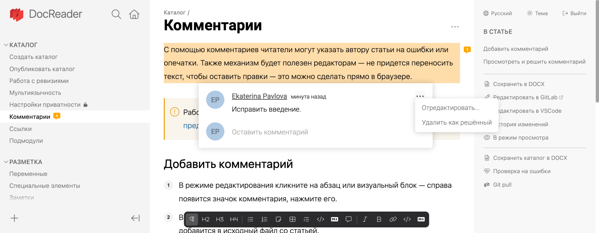

С помощью комментариев читатели могут указать автору статьи на ошибки или опечатки. Также механизм будет полезен редакторам -- не придется переносить текст, чтобы оставить правки -- это можно сделать прямо в браузере.

:::note 

Работа с комментариями доступна только в [приложении для предпросмотра](.../local).

:::

:::info
Комментарии сохраняются в исходный файл статьи. Потому любые действия нужно публиковать с помощью Commit и Push.
:::

## Добавить комментарий

1. В режиме редактирования кликните на абзац или визуальный блок -- справа появится значок комментария, нажмите его.

2. Введите комментарий и нажмите *Комментировать* -- комментарий добавится в исходный файл со статьей.
   

3. Опубликуйте комментарий -- сделайте Commit и Push.

## Просмотреть и решить комментарий

:::note Если комментарии не отображаются

Комментарии доступны только авторизованным пользователям. Так что не забудьте войти, прежде чем начать работу.

:::

1. Откройте статью -- блок, на который оставлен комментарий, будет выделен желтым. Справа будет значок с количеством комментариев в цепочке.

2. Решите комментарий:
    - Если нужно продолжить переписку, введите свой ответ и кликните *Комментировать*. Затем опубликуйте ответ -- сделайте Commit и Push.
    - Если комментарий понятен, внесите исправления и удалите комментарий. Затем опубликуйте изменения -- сделайте Commit и Push.
