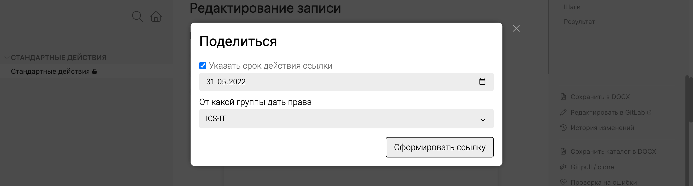

По умолчанию статьи, разделы и подразделы могут видеть все пользователи. Доступ к каталогу или к статье можно ограничить по компании, а затем выдать доступ некоторым внешним читателям. 

## Ограничить доступ к каталогу
Чтобы каталог был доступен только сотрудникам компании, в файле `.doc-root.yaml` в параметре `group` установите:
- `company` -- если в каталоге будет внутренняя документация команды или компании 
- `projects` -- если в каталоге будет проектная документация.

## Ограничить доступ к статье
Чтобы ограничить доступ к отдельной статье, добавьте аттрибут `private`. 

Этот аттрибут можно также указать для каталога или подраздела в YAML-файле. Например, если каталог по группе относится к продуктам, но пока не должен быть доступен внешним пользователям.

- Доступ к чтению получит пользователь, который состоит хотя бы в одной из перечисленных групп в Azure Active Directory.

    ```
    private:
        - ICS-IT
        - mygroup
    ```
- Доступ к чтению получает любой аутентифицированный пользователь (сейчас это только аккаунты ICS).

    ```
    private: true
    ```


## Поделиться приватным каталогом

В DocReader можно поделиться приватным каталогом с помощью кнопки [cmd:Поделится:share-from-square] -- она находится в правом меню и доступна аутентифицированным пользователям.

При нажатии создается ссылка, по которой внешние пользователи смогут просматривать каталог и статьи, в которых проставлены группы из Azure Active Directory.

При создании ссылки можно указать:
- Срок действия ссылки -- если не указано, то ссылка будет действовать бессрочно.
- От какой группы дать права -- если не указано, то доступ будет по всем доступным группам.


_Пример создания ссылки_
