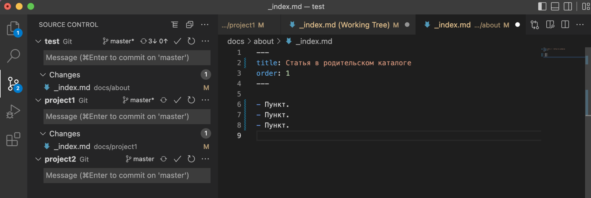

Вы можете добавить в каталог статьи из разных репозиториев. Например, чтобы объединить документацию из разных проектов.

Это делается с помощью механизма подмодулей.

## Создать каталог с подмодулями

1. Например, у нас есть родительский каталог, который называется `ParentCatalog`. Нам нужно объединить документацию из репозитория `ChildDocsRepo`. Пусть путь будет такой: `ParentCatalog/docs/ChildDocs`.

2. Откройте терминал в папке родительского репозитория, введите команду `git submodule add {ssh-url} {путь по которому будет лежать реп}` для каждого репозитория-подмодуля. Подмодулей может быть несколько. В нашем примере команды будут выглядеть так:

   `git submodule add git@github.com:ChildDocsRepo.git docs/ChildDocs`.

   В результате автоматически склонируется репозиторий с документацией и в корневом каталоге основного репозитория создастся файл `.gitmodules`.

3. Создайте в репозиториях-подмодулях файл `.category.yaml` рядом с файлом `.doc-root.yaml`. Заполните его как для [обычного раздела](.../catalog#%D1%80%D0%B0%D0%B7%D0%B4%D0%B5%D0%BB%D1%8B).

## Склонировать каталог с подмодулями

Прежде чем начинать работу со статьями, нужно склонировать каталог вместе с подмодулями. Проще всего это сделать в интерфейсе DocReader.

В [приложении для предпросмотра](.../local) на [cmd:Главной странице:house] нажмите [cmd:Git clone:git] и заполните поля.

Каталог с подмодулями автоматически склонируется в корневую директорию документации.


## Внести изменения в статьи подмодуля

Внести изменения в статьи подмодуля можно двумя способами:

1. [Склонировать родительский каталог с подмодулями](#склонировать-каталог-с-подмодулями). Тогда в VSCode на вкладке с изменениями будет отображаться как родительский каталог, так и подмодули.

   
   *Каталог с подмодулями*

2. Склонировать каталог подмодуля. После публикации изменений, они также отобразятся в родительском каталоге.


## [#changeBranch] Сменить ветку в подмодуле

По умолчанию в подмодуле используется ветка *master*. Но ее можно изменить.

1. Откройте файл `.gitmodules` в родительском репозитории и задайте другую ветку с помощью конструкции `branch = {имя ветки}`. Например:

   ```
   [submodule "docs/test"]
       path = docs/test
       url = git@gitlab.ics-it.ru:test.git
       branch = some_branch
   ```

2. Опубликуйте изменения в родительском репозитории стандартным способом.

3. Поменяйте ветку в подмодулях. Сделать это можно 2 способами:

   - При помощи VSCode:

      1. В VSCode откройте папку с подмодулем.

      2. В левом нижнем углу нажмите на название ветки.

      3. В появившемся окне выберите нужную ветку.

      4. Опубликуйте изменения в основном репозитории.

   - При помощи [приложения для предпросмотра](.../local):

      1. Откройте каталог в приложении для предпросмотра.

      2. Нажмите [cmd:Git pull:git].


## Возможные ошибки

### 1. В подмодуле вместо ветки написаны цифры и буквы
**Причина:** для рекурсивного клонирования каталога вы использовали команды, а не встроенную возможность [cmd:Git clone:git]. Git автоматически определил название последнего коммита и принял его за ветку.

**Решение:** [**смените ветку в подмодуле**](#changeBranch). После этого можно вносить изменения.
