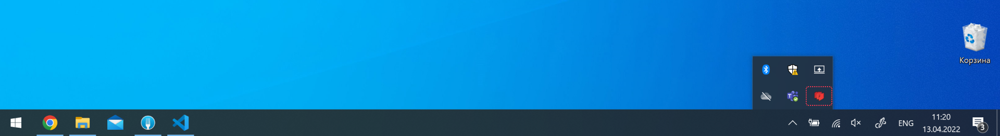

Чтобы начать работу в приложении, разверните его на компьютере.

:::note Почему другие не видят мою статью

Приложение работает только на том компьютере, на котором запущено. Чтобы другие люди могли просматривать вашу статью, опубликуйте ее.

:::

1. Скачайте приложение по ссылке:

   - Для [Windows](https://docs.ics-it.ru/-download?platform=win).

   - Для [Mac](https://docs.ics-it.ru/-download?platform=mac_x64).

2. Разархивируйте и запустите приложение.

   :::note Не запускается на Mac

   Откройте терминал в каталоге, где находится приложение. Пропишите команду `xattr -cr DocReader.app`. После этого приложение запустится.

   :::

3. Нажмите иконку DocReader и выберите *Установить корневую директорию документации*. В зависимости от системы, иконка отображается:

   - В [системном трее](https://ru.wikipedia.org/wiki/%D0%9E%D0%B1%D0%BB%D0%B0%D1%81%D1%82%D1%8C_%D1%83%D0%B2%D0%B5%D0%B4%D0%BE%D0%BC%D0%BB%D0%B5%D0%BD%D0%B8%D0%B9) для Windows.
      

   - В [строке меню](https://support.apple.com/ru-ru/guide/mac-help/mchlp1446/mac) для Mac.
      

4. В появившемся окне введите путь до папки, в которую склонированы репозитории с документацией.
   

5. Запустите приложение.

В браузере автоматически откроется страница [http://localhost:3000/](http://localhost:3000/) -- на ней можно просматривать все изменения.

:::note Не отображаются каталоги

Приватные каталоги видны только авторизованным пользователям. Войдите в DocReader, чтобы их просматривать.

:::

:::note Приложение сильно зависает

В корневой директории документации должны быть каталоги, в которых содержаться только статьи.

:::