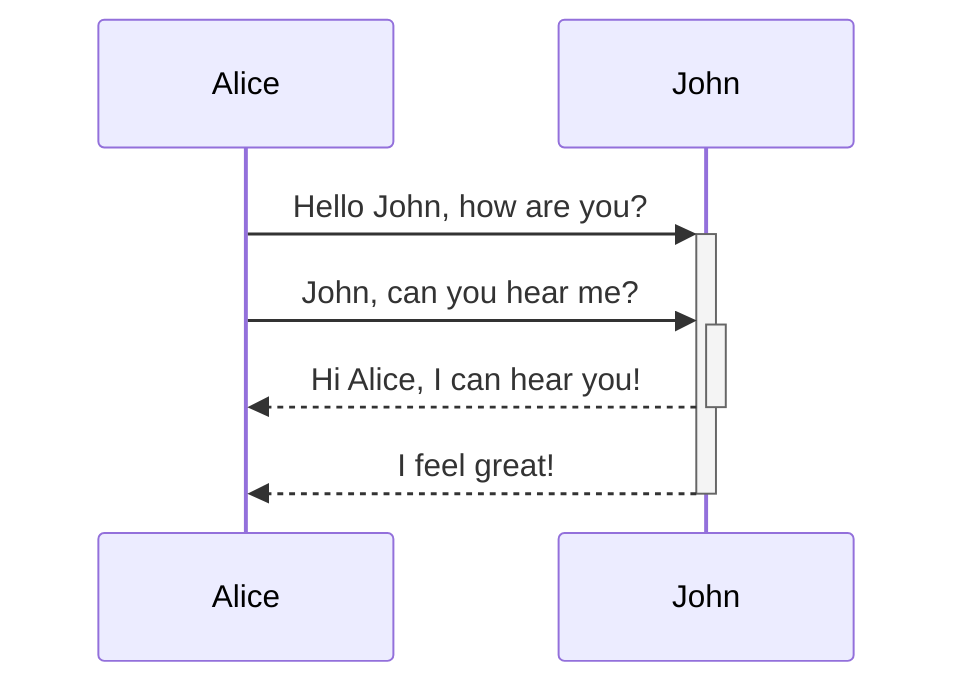
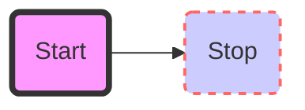

Mermaid — специализированный синтаксис, для создания и визуализации диаграмм. Полное описание его возможностей можно посмотреть по [ссылке](https://mermaid-js.github.io/mermaid/#/)

Для того чтобы отобразить диаграмму достаточно прописать `[mermaid:{путь}]` , где `путь` — путь к mermaid-файлу, относительно статьи.
Или же можно использовать следующую конструкцию:

````
```mermaid
<описание диаграммы>
```
````

-   Синтаксис `mermaid` можно посмотреть [тут](https://mermaid-js.github.io/mermaid/#/flowchart?id=flowcharts-basic-syntax)
-   Визуальный редактор диаграмм находится [тут](https://mermaid-js.github.io/mermaid-live-editor/#/edit/).

## Примеры

```
[mermaid:./resources/sample.mermaid]
```

[mermaid:./resources/sample.mermaid]

````

````


````

````


