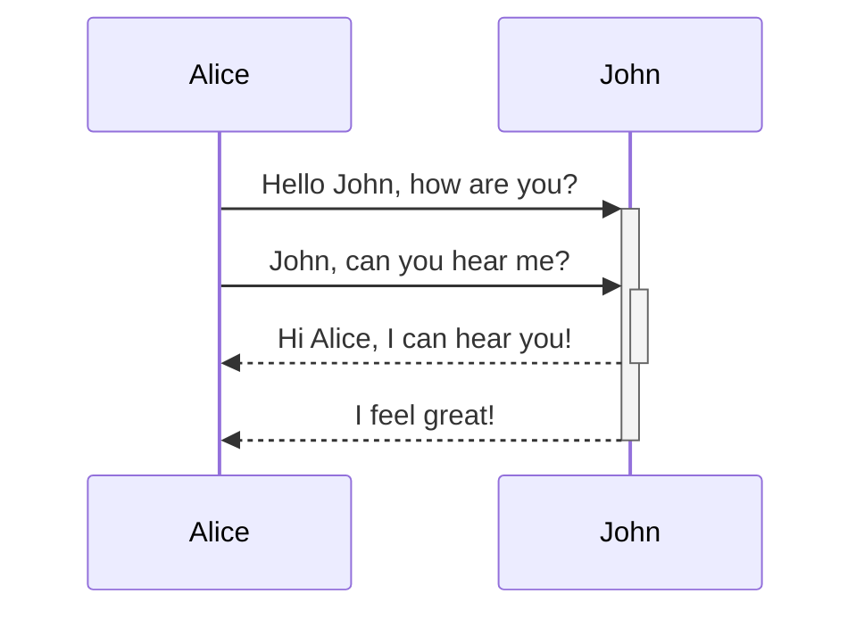

### Текст

Просто текст _Курсив_ **Жирный текст** ~~Зачёркнутый текст~~

---

### Код

`inline code`

```
fence
code
```

---

### Заголовки

# Заголовок1

## Заголовок2

### Заголовок3

#### Заголовок4

##### Заголовок5

###### Заголовок6

---

### Таблицы

| 1   | 2   | 3   |
| --- | --- | --- |
| 4   | 5   | 6   |



---

-   foo test test
-   `some long colspan 2 text here some long colspan 2 text here`

---

-   foo test test\
    more foo test
-   ```
    code
    block
    here
    ```
-   1. List 1
    2. List 2
    3. List 3 

---

-   foo test test
-   baz align right 



---

### Изображение


_Название рисунка_


_С title и alt_

### Группы изображений

[img-h:../images/1.svg:../images/2.svg]

[img-v:../images/1.svg:../images/2.svg]

---

### Ссылки

https://google.com/

google.com

[google](https://yandex.ru)

[каталог](./../catalog)

[статья](./../catalog/comments)

[ниже](#docgen)

---

### Списки

1. Нумерованый список 1
2. Нумерованый список 2
3. Нумерованый список 3
    - Вложенный список 1
    - Вложенный список 2
    - Вложенный список 3

-   Ненумерованый список 1
-   Ненумерованый список 2
    1. Вложеный список 1
    2. Вложеный список 2
    3. Вложеный список 3
-   Ненумерованый список 3

---

### Специальные элементы

| Элемент          | Код                            | Результат                    |
| ---------------- | ------------------------------ | ---------------------------- |
| Стрелка          | `-->`                          | -->                          |
| Тире             | `--`                           | --                           |
| Экранирование    | `\--`                          | \--                          |
| Кнопка           | `[cmd:Это кнопка]`             | [cmd:Это кнопка]             |
| Кнопка с иконкой | `[cmd:Кнопка:alien]`           | [cmd:Кнопка:alien]           |
| Кнопка-иконка    | `[cmd::alien]`                 | [cmd::alien]                 |
| Сочетание клавиш | `[kbd:Ctrl+Z]`                 | [kbd:Ctrl+Z]                 |
| Иконка           | `[icon:alien-monster:light]`   | [icon:alien-monster:light]   |
| Цветная иконка   | `[icon:codepen:brands:green]`  | [icon:codepen:brands:green]  |
| Альфа-метка      | `[alfa]`                       | [alfa]                       |
| Бета-метка       | `[beta]`                       | [beta]                       |
| Заявка           | `[issue:DR-1]`                 | [issue:DR-1]                 |
| Модуль           | `[module:generator]`           | [module:generator]           |
| Перенос строки   | `1[br]2`                       | 1[br]2                       |
| Измнение цвета   | `[color:#ffa500]Текст[/color]` | [color:#ffa500]Текст[/color] |
| Who              | `[who:Scrum master]`           | [who:Scrum master]           |
| When             | `[when: на демо]`              | [when: на демо]              |

---

### Переносы

Перенос\
строки `\`

Перенос<br>строки `<br>`

---

### See

[see:#img-group]

[#:img-group] Можно сгруппировать несколько изображений по горизонтали или вертикали.

---

### Пользовательские заголовки

## Генерация документов [#:docgen]

### Мой пользовательский заголовок {#custom-id}

---

### Заметки

:::note Заголовок
тело
:::

:::
тело заметки без заголовка
:::

::: заметки без nekf
:::

---

### Формулы

$L = \frac{1}{2} \rho v^2 S C_L$

---

### Термины

[term:md:маркдаун]

---

### Скрытие фрагментов

[cut]
Блочный текст

Блочный текст2
[/cut]

Инлайновый текст [cut:Новый текст:true]123123123123[/cut] конец инлайнового текста

[cut]

```
some block here
```

[/cut]

---

### Функциональные блоки

[fn:ics.account:Иван Иванов]

---

### Видео

[video:sample-mp4-file.mp4:Очень интересное видео]

---

### Вставка содержимого статей

[include:./article-block_inner.md]

---

### Цитаты

> First line
> Another line
>
> > Nested line
>
> Last line

---

### Диаграммы

Ts-diagram tag:

[ts-diagram:./diagrams/resources/ts-diagram.ts]

Ts-diagram fence:

```ts-diagram
interface DocReader {
	catalogs: Catalog[];
}

interface Catalog {
	articles: Article[];
}

interface Article {
	title: string;
	content: string;
}
```

ER-diagram tag:

[db-diagram:./diagrams/resources/er-diagram.yaml]

ER-diagram tag with props:

[db-diagram:./diagrams/resources/er-diagram.yaml:-hidden,#onlytitle]

Mermaid-diagram tag:

[mermaid:./diagrams/resources/sample.mermaid]

Mermaid-diagram fence:



PlantUml-diagram tag:

[plant-uml:./diagrams/resources/plantUml.puml]

PlantUml-diagram fence:

```plant-uml
@startuml
Bob -> Alice : hello
@enduml
```

Diagram-net tag:

[drawio:./diagrams/resources/drawio.svg]

C4-diagrams tag:

[c4-diagram:./diagrams/resources/c4DiagramTest.dsl]

C4-diagrams fence:

```c4-diagram
workspace {

    model {
        user = person "User"
        softwareSystem = softwareSystem "Software System" {
        }

        user -> softwareSystem "Uses"
    }

    views {
        systemContext softwareSystem "Diagram1" {
            include *
            autoLayout
        }

        theme default
    }

}
```

C4-diagrams nested:

[c4-diagram:./diagrams/resources/c4DiagramTestNested.dsl]

Db-table tag:

[db-table:Contract:./dev/schema.yaml]

OpenApi tag:

[openapi:./dev/openapi.yaml]
