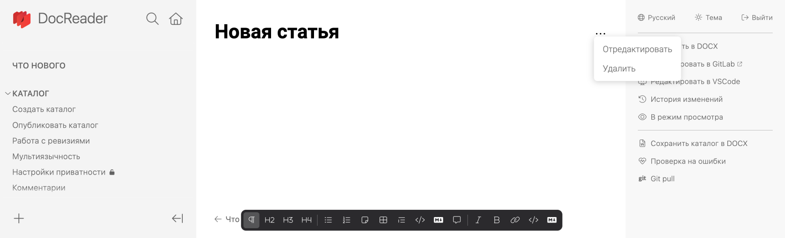
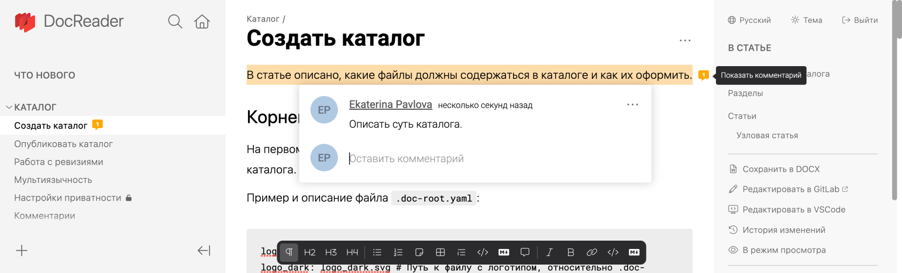
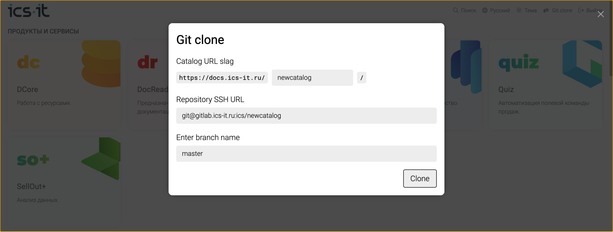
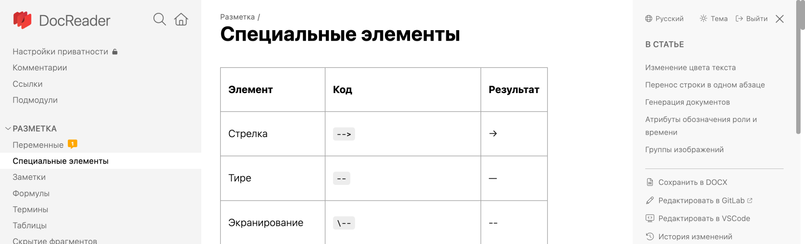

Доработка DocReader происходит не по спринтам, а по отдельным заявкам. В этой статье будем описывать новые функции, которые выпустили за последнее время.

Если у вас есть замечания или комментарии, [напишите нам](mailto:andrey.lastochkin@ics-it.ru)!

## 2022.09.29

- **Улучшения визуального редактора**:
    - Новая панель редактирования -- теперь все элементы редактирования выводятся не в правой панели, а внизу статьи.
    - Создание и редактирование статей -- добавили возможность создать новую статью или изменить параметры существующей.
    - Добавление ссылок -- теперь в редакторе можно добавить ссылку на слово стандартным способом.
    - Заголовки только 2, 3 и 4 уровня -- в обновленном редакторе можно добавить только те заголовки, которые соответствуют стайлгайду.
    

- **Блочные комментарии**. Значительно переработали механизм комментариев:
    - Отображение в статье -- теперь не нужно переходить в историю изменений, чтобы оставить или просмотреть комментарий.
    - Работа по блокам -- комментарий можно оставить на абзац или элемент статьи, а не выделенную строку.
    - Хранение истории комментариев -- комментарии добавляются в исходный файл статьи и публикуются в репозиторий. Решенные цепочки комментариев удаляются из статьи. В любой момент можно в репозитории проверить, кто и когда добавил/удалил комментарий.
    - Уведомление о комментариях -- на статье в левой панели остается привычный значок комментариев. Дополнительно внутри статьи можно увидеть на блоке количество сообщений в цепочке.
    

- **Прочие доработки**:
    - Скрытие панелей при чтении статьи -- сделали кнопку, которая скрывает правую и левую панель. 
    - Переход в начало статьи. Если кликнуть *В статье* -- страница вернется на самый верх. Это удобно в случае, если статья очень длинная.
    - Поддержка синтаксиса Gherkin -- теперь в статьи можно добавлять Gherkin-код, он будет корректно подсвечиваться.

## 2022.08.25
- **Клонирование репозитория из интерфейса**. Теперь можно склонировать репозиторий на главной странице DocReader. Особенно это удобно для репозиториев с подмодулями -- они инициализируются без дополнительных команд.

*Окно клона в интерфейсе*
- **Редактирование таблиц в визуальном редакторе**. Добавили возможность создавать и редактировать таблицы в визуальном редакторе. Также доработали стиль таблиц -- столбцы и строки теперь разделены.

*Новый стиль таблиц*
- **Документация по ссылкам**. Более явно прописали логику относительных ссылок. Также подготовили подробную [документацию](.../catalog/links) по всем видам ссылок. 

## 2022.08.04

- **Режим редактирования по умолчанию** -- теперь статьи в приложении для предпросмотра сразу доступны для редактирования. Все исправления автоматически сохраняются в локальных файлах, после чего их можно опубликовать стандартным способом.

- **Быстрый ввод спецсимволов** -- добавлены стандартные комбинации символов, которые при вводе конвертируются в спецсимволы. Например, символы `-->`  автоматически сконвертируются в -->. Полный список конвертируемых символов можно найти [здесь](../local/wysiwyg#typography).

- **Панель команд редактирования** -- в правое меню добавили кнопки, применяющие стили для абзацев. Есть стили, действующие на абзац, а есть на отдельные символы. Для большинства стилей есть горячие клавиши, они отображаются в тултипах.

- **Подмодули** -- сделали возможность включить в каталог другие репозиториев в качестве дочерних. Например, чтобы объединить документацию из разных проектов. Подробнее в статье *[Подмодули](../catalog/submodules)*.

- **Коды статей для внешних ссылок** -- сделали возможность задать статье уникальный код для внешних ссылок. Чтобы статья была всегда доступна по этому коду, независимо от ее расположения. Подробнее в статье *[Внешние ссылки на статьи](../catalog/refs)*.

## 2022.07.07

- **Новые возможности Markdown**. Перешли на другую внутреннюю библиотеку по работе с Markdown -- был [Remark](https://remark.js.org/), стал [Markdoc](https://markdoc.io/). Это предоставило следующие новые возможности:

    - Добавили [таблицы с поддержкой блочного содержимого](../markdown/table#markdoc-table).

    - Сделали [возможность добавления переменных](../markdown/variables).

    - Добавили [перенос строки в одном абзаце](../markdown/special#br).

- **Оптимизация размера и скорости работы приложения**:

    - Размер веб-приложения снизился больше чем на треть -- с 7.52 MB до 4.78 MB.

    - Размер приложения для предпросмотра уменьшился с 420 MB до 369 MB.

    - Скорость отображения статьи увеличилась в 2.5 раза, для средней статьи c ≈60ms до ≈24ms.

- **Breaking changes**. Вставки кода HTML больше не будут работать. Это было сделано в целях безопасности и устранения XSS-уязвимости. Например, элемент `text` больше не будет работать. Вместо него используйте стандартные элементы Markdown.

    - Чтобы выделить цветом, используйте [изменение цвета текста](../markdown/special#color).

    - Чтобы скрыть часть текста, используйте [скрытие фрагментов](../markdown/cut).

- **Визуальный редактор**. Собрали бета-версию приложения для предпросмотра с возможностью редактирования прямо в браузере. Пока визуальный редактор ограничен и не для всех элементов доступно визуальное редактирование. Подробнее о реализованных возможностях визуального редактора читайте в [статье](./local/wysiwyg).

## 2022\.05.26

- **C4-диаграммы**. Добавили новый вид диаграмм Structurizr. Она используется для описания одноименной модели [C4](../markdown/diagrams/c4Diagrams.md).

- **Прочие улучшения**:
    - Кнопка обновления списка веток. Добавили в модальное окно *Git pull* кнопку для обновления списка веток. Она полезна в том случае, если ветку только что добавили и она ещё не отобразилась в списке.

    - Остановка Gif. Теперь можно остановить и заново запустить гифки.

    - Отображение подрепозиториев. Добавили возможность создавать категории, как отдельный репозитории. Например -- [https://docs.ics-it.ru/modules](https://docs.ics-it.ru/modules). Для этого необходимо прописать файл `.gitmodules` с указанием каталогов, репозиториев и веток.

    - Перенесли кнопку *clone*. Перенесли кнопку [cmd:Git clone:git] на главную страницу.

## 2022\.05.04

- **Диаграммы**. Добавили 2 новых типа диаграмм:

    - [TS-диаграммы](./markdown/diagrams/ts-diagram) -- удобно использовать для описания архитектуры системы.

    - [PlantUML](./markdown/diagrams/plantUml) -- является промежуточным стандартом для специфических форматов, таких как Structurizr.

- **Приложение для предпросмотра**:

    - Формирование облегченных диаграмм. Вынесли формирование диаграмм во внешний отчуждаемый сервис, чтобы уменьшить размер дистрибутива приложения для предпросмотра.

    - Простой способ установки корневой директории. Раньше для установки корневой директории документации нужно было прописывать адрес. Теперь ее можно указать стандартным способом -- кликнуть *Открыть* и перейти в нужную папку.

    - Скачивание обновлений из уведомления. Добавили возможность скачать новую версию DocReader из самого уведомления о новой версии.

- **Доступ к приватным каталогам**. Сделали кнопку *Поделиться* -- при нажатии генерируется тикет аутентификации для этого каталога. По нему внешний пользователь сможет просматривать приватные статьи.

- **Прочие доработки**:

    - Улучшения для работы с Git. Перенесли URL репозитория в модальное окно, которое открывается при нажатии кнопки *Pull*. Также сделали выпадающий список со всеми доступными ветками.

    - Открытие окна поиска с клавиатуры. Раньше окно поиска открывалось при нажатии [kbd:/] -- команда не всегда срабатывала, поэтому теперь нужно использовать [kbd:command+/] на Mac и [kbd:Ctrl+/] на Windows.

## 2022\.03.30

- **Приложение в фоновом режиме**. Недавно мы разработали приложение DocReader для предпросмотра статей. Как оказалось, многие пользователи просматривали статьи в браузере, а не в самом приложении. Поэтому теперь приложение работает в фоновом режиме. Оно отображается только в системном трее.

- **Поисковая оптимизация для сайтов (SEO)**. Теперь для сайта на базе DocReader можно добавить Sitemap и Meta-теги. Они влияют на то, как сайт индексируется в поисковых системах. Подробнее в статье [Поисковая оптимизация](../site-builder/searchOptimization).

- **Работа с GitLab в модальном окне**. Раньше при клике на кнопки для работы с GitLab открывалась страница с набором самых разных данных. Было трудно разобраться, какие из них полезны, а какие -- нет. Теперь при клике появляется модальное окно, в котором содержатся только те данные, которые полезны для работы со статьями. Подробнее в статье [Работа с ревизиями](../catalog/publish.md).

- **Проверка на ошибки**. Раньше для проверки ссылок использовался Healthcheck, теперь в правом меню есть кнопка *Проверка на ошибки* -- по клику открывается окно, в котором отображаются все сломанные ссылки и ошибки в YAML-файлах. Подробнее в статье [Проверка на ошибки](../dev/healthcheck)

- **Сайт для MDM**. Теперь проверять востребованность решений на базе MDT можно с помощью простых лендингов. В качестве примера можно рассмотреть сайт [MDM](https://ics-it.ru/-develop), который удалось подготовить на основе DocReader за 1 день.

- **Функциональные блоки**. Теперь в статьи можно добавить интерактивные блоки. В качестве примера сделали функцию, которая предлагает пользователю по одному клику транслитерировать свои ФИО. Подробнее в статье [Функциональные блоки](../markdown/fn-block).

- **Прочие доработки**:

    - Копирование инлайн-кода в статьях. Раньше была возможность скопировать только целый блок кода, теперь можно скопировать строку или команду -- любой текст, оформленный в бэктики.

    - Доработки стилей. Доработали внешний вид таблиц -- исправили выравнивание и убрали фон. Также сделали кодовый блок (элемент, заключенный в бэктики) серым.

    - Лого для темной и для светлой темы. Теперь можно добавить два логотипа для каталога -- один будет отображаться в темной теме, другой -- в светлой. Это нужно для того, чтобы логотип не сливался с фоном.

    - Редактирование комментария по двум кликам. Теперь можно два раза кликнуть по комментарию, чтобы отредактировать его.

## 2022\.01.12

- **Новый вид главной страницы**. Обновили внешний вид главной страницы. Также сделали на ней поиск по всем каталогам.

- **Оптимизированный поиск**. Доработали механизм поиска: теперь результаты выдаются быстрее и точнее.

- **Открытие статьи в VSCode из приложения**. Добавили в правое навигационное меню кнопку *Редактировать в VSCode*. Теперь не придется искать статью в репозитории, чтобы отредактировать -- в нее можно перейти прямо из [приложения DocReader](../local).

## 2021\.12.29

- **Приложение для предпросмотра**. Сделали приложение, в котором можно просматривать статьи до публикации. С его помощью вы вовремя заметите, что где-то поехала разметка или неправильно отобразился [специальный элемент](../markdown/special). Как развернуть приложение и где просматривать статьи читайте [тут](../local).

- **Комментарии**. Правки и их обсуждение стали проще! Больше не придется копировать текст, чтобы в стороннем приложении оставить замечания к тексту или пометить опечатки. Комментируйте и обсуждайте статьи прямо в браузере. Как оставить комментарий и что делать с ним дальше читайте в статье [Комментарии](././catalog/comments.md).

- **Доработка механизма обновления кэша**. Теперь при публикации изменений кэш обновляется без ошибок.

## 2021\.11.1

- **Узловая статья подраздела**. Теперь для подраздела можно создать узловую статью -- она будет открываться, когда пользователь нажмет в каталоге название подраздела. Подробнее читайте в статье [Структура каталога](../catalog#%D1%83%D0%B7%D0%BB%D0%BE%D0%B2%D0%B0%D1%8F-%D1%81%D1%82%D0%B0%D1%82%D1%8C%D1%8F).

- **Диаграммы diagrams.net**. В статью можно добавить диаграмму, созданную в [diagrams.net](https://www.diagrams.net/) (бывший [draw.io](https://en.wikipedia.org/wiki/Diagrams.net)). А также редактировать его в визуальном редакторе. Подробнее читайте в статье [Диаграммы diagrams.net](../markdown/diagrams/drawio.md).

- **Скрытие правой панели**. Теперь можно скрыть правую панель, чтобы удобнее было читать статью. Действия и кнопка *Вернуть панель* отобразятся внизу.
