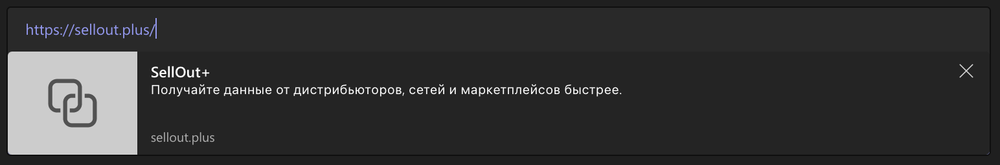

**DocReader** можно использовать не только для хранения документации, но и в качестве движка для сайтов.

Ключевые возможности:

-   **Сайт как набор YAML**. Возможность работать с сайтом как со строго типизированной структурой в формате YAML (headless CMS).
-   **CI/CD**. Сайт хранится в репозитории. При коммите проходит CI, в т.ч. сайт тестируется на целостность.
-   **Расширенный Markdown**. Оформление содержимого с мощью Markdown и элементов доступных в DocReader.
-   **[Поисковая оптимизация](searchOptimization)**. Возможность гибкой настройки поисковой выдачи.
-   **[Open Graph](#openGraph)**. Отображение ссылки в соцсетях и мессенджерах в виде карточки.

Примеры сайтов, сделанных в Site Builder:

-   [ics-it.ru](https://ics-it.ru)
-   [sellout.plus](https://sellout.plus)
-   [alfa] [MDM](https://ics-it.ru/-develop)

### Open Graph {#openGraph}

[Open Graph](https://ogp.me/) -- протокол, который предназначен для того, чтобы при отправке ссылок по соцсетям формировалась карточка, которая содержит заголовок, описание и картинку.

#### Пример настройки картки: заголовка и описания страницы

```yaml
title: Контролируйте цепочку продаж # Заголовок отображающийся в заголовке
description: Получайте данные от дистрибьюторов, сетей и маркетплейсов быстрее. Увеличьте скорость подготовки отчётов о движении товаров. Рассчитывайте премии в отделе продаж на проверенных данных. # Описание отображающийся в заголовке
image: images/cover.svg # Картинка отображающийся в заголовке
theme: purple # Тема страницы

meta:
    title: SellOut+ — Загрузка и обработка вторичных продаж и остатков в облаке # Название вкладки в браузере
    openGraph:
        title: SellOut+ # Название страницы в карточках соцсетей
        description: Получайте данные от дистрибьюторов, сетей и маркетплейсов быстрее. # Описание страницы в карточках соцсетей
```


_Заголовок, описание и картинка для страницы sellout.plus_
