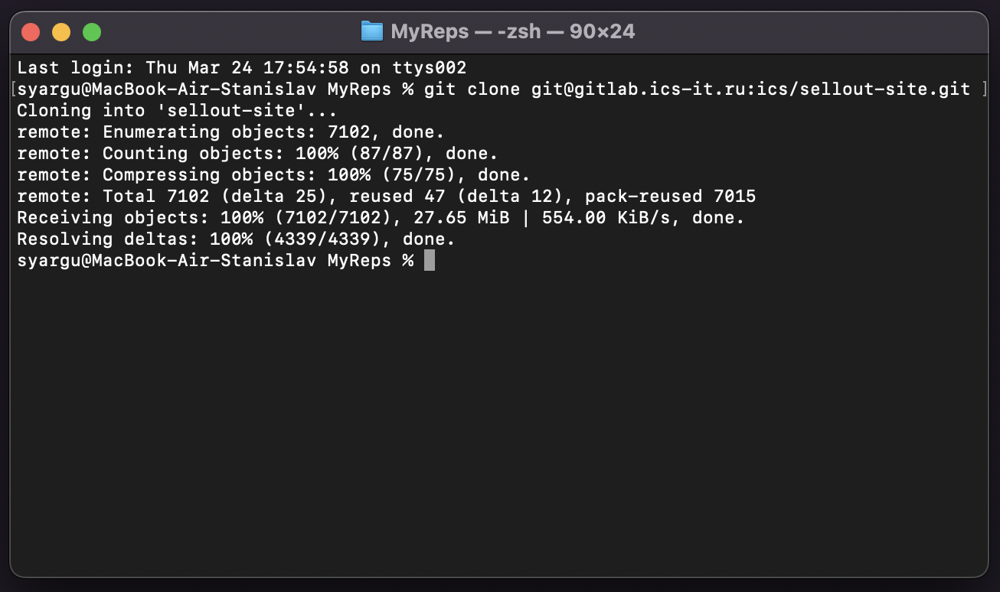

Для локального развертывания Site builder необходимо:

1. [Склонировать репозиторий](#clone) [sellout-site](https://gitlab.ics-it.ru/ics/sellout-site), на свой компьютер.
2. [Собрать и запустить сайт](#run). Сайт будет доступен по ссылке [localhost:3000](http://localhost:3000/).

## Клонирование репозитория {#clone}

Для того, чтобы склонировать репозиторий вам необходимо

-   Иметь [Git](https://git-scm.com/) -- локальное ПО для работы с Git. Скачать можно по следующей [ссылке](https://git-scm.com/downloads).
-   Иметь учетную запись в [Gitlab](https://gitlab.ics-it.ru/).
    Если у вас его нет, необходимо обратиться к непосредственному руководителю.
-   Иметь доступ к репозиторию. Для этого запросите у руководителя доступ к [репозиторию](https://gitlab.ics-it.ru/ics/sellout-site).

После того, как все было подготовлено для клонирования, необходимо

-   Открыть консоль в каталоге, где хотите хранить склонированный репозиторий.
-   Прописать в консоли команду `git clone git@gitlab.ics-it.ru:ics/sellout-site.git`
    

## Сборка и запуск сайта {#clone}

Для того, чтобы собрать и запустить сайт

-   Иметь [Node.js](https://nodejs.org/en/) -- среда, где выполняются команды сборки и запуска. Скачать можно по следующей [ссылке](https://nodejs.org/en/download/).

После того, как все было подготовлено к сборке и запуску, необходимо

-   Открыть консоль в каталоге репозитория. Для этого можно прописать в прошлой консоли команду `cd sellout-site`.
-   Прописать следующую последовательность команд
    -   `npm i` -- скачивает библиотеки для запуска сайта
    -   `npm run build` -- собирает сайт
    -   `npm run start` -- запускает сайт
-   После запуска сайта, он будет доступен по ссылке [localhost:3000](http://localhost:3000/)

:::info
Для выключения сайта необходимо нажать сочетание клавиш [kbd:Ctrl+C] в консоли
:::

## Изменение отображаемого сайта

За отображение определенного сайта отвечает переменная окружения `START_SITE_NAME`.
Он может принимать следующие значения:

-   `sellout` -- сайт [sellout.plus](https://sellout.plus/)
-   `ics-it` -- сайт [ics-it.ru](https://ics-it.ru)
-   `mdm` -- сайт [alfa] [MDM](https://ics-it.ru/-develop)

### Установка переменного окружения

Для Windows -- прописать в консоли команду `SETX START_SITE_NAME=sellout`

Для Mac -- открыть файл `/Users/<userName>/.zshrc` и прописать в нем `export START_SITE_NAME=ics-it`

:::note Нет файла
По умолчанию файл `.zshrc` скрыт. Для того чтобы он появился необходимо нажать сочетание клавиш [cmd:Shift] + [cmd:Command] + [cmd:.]
:::
